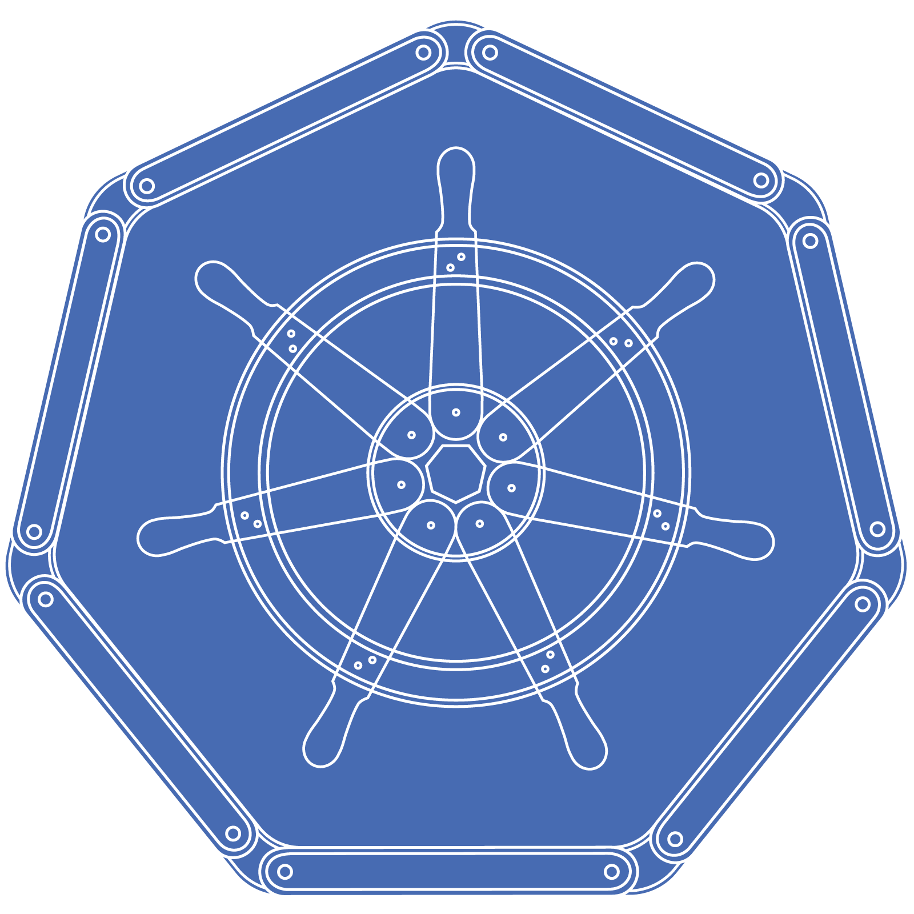
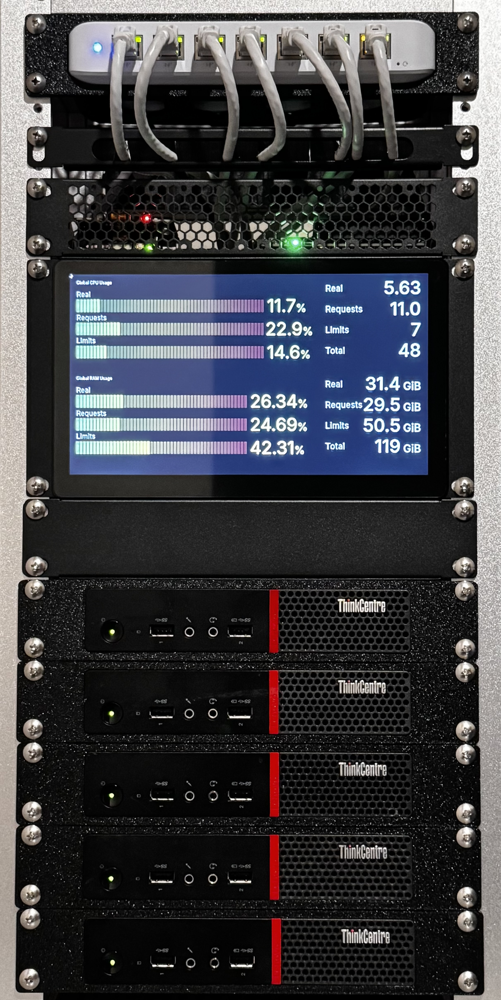
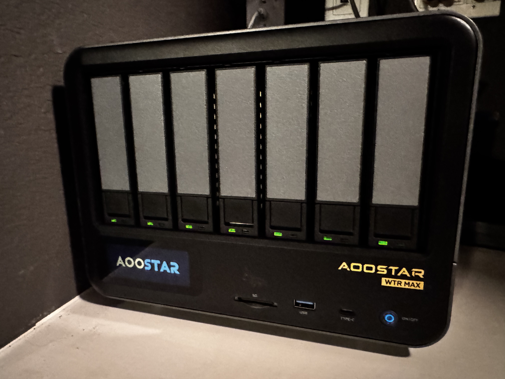
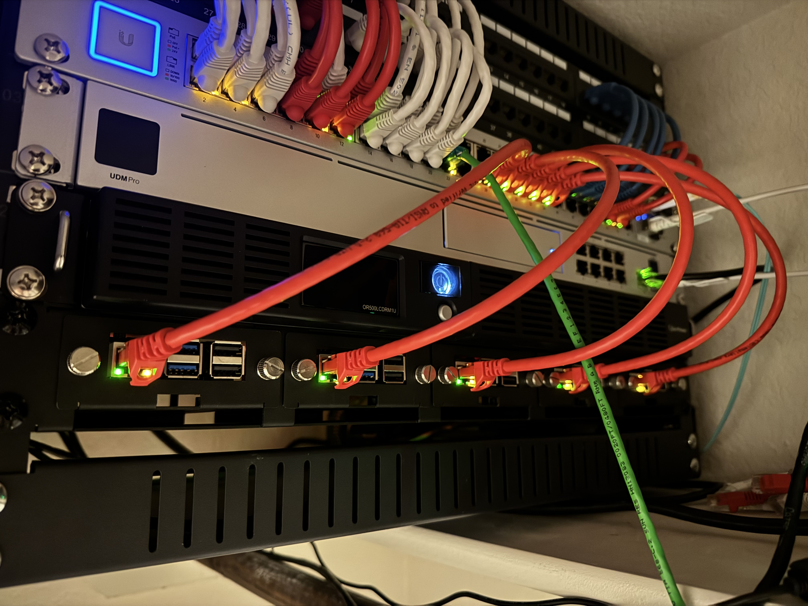

###  Homelab 

_... managed with Flux, Renovate, and Github Actions_ 🤖

   
 %40sha256%3A&replace=V%241&style=for-the-badge&logo=renovate&logoColor=white&label=Renovate)  
  

## 🛠️ Tools

| Tool                                     | Purpose                                                                          |
|------------------------------------------|----------------------------------------------------------------------------------|
| [Flux](https://fluxcd.io/flux/)          | Operator to manage your K8S cluster based any number of sources including GitHub |
| [Renovate](https://docs.renovatebot.com) | Tool to automate dependency updates                                              |
| [SOPS](https://github.com/getsops/sops)  | K8S secrets and configmap manager to encrypt secrets with GnuPG for storage      |

<h2>
    

        
🖥️ Cluster / Nodes

        
    

</h2>

| System             | RAM  | Storage        | Role      | OS         |
|--------------------|------|----------------|-----------|------------|
| Raspberry Pi       | 8GB  | 128GB NVMe SSD | Dashboard | FullPageOS |
| Radxa Rock 5B      | 32GB | 1TB NVMe SSD   | Master    | Talos      |
| Lenovo ThinkCentre | 32GB | 1TB NVMe SSD   | Master    | Talos      |
| Lenovo ThinkCentre | 16GB | 1TB NVMe SSD   | Master    | Talos      |
| Lenovo ThinkCentre | 16GB | 1TB NVMe SSD   | Worker    | Talos      |
| Lenovo ThinkCentre | 16GB | 2TB NVMe SSD   | Worker    | Talos      |
| Lenovo ThinkCentre | 16GB | 2TB NVMe SSD   | Worker    | Talos      |

<h2>
    

        
📦 Storage

        
    

</h2>

| System                 | RAM   | Storage             | OS            |
|------------------------|-------|---------------------|---------------|
| Supermicro 6028U-TR4T+ | 128GB | 12 x 8TB HDD RAIDZ3 | TrueNAS Scale |
| AOOSTAR WTR MAX        | 32GB  | 6 x 16TB HDD RAIDZ3 | TrueNAS Scale |

<h2>
    

        
🛜 Network

        
    

</h2> 

| Vendor   | Model             | Function                                        |
|----------|-------------------|-------------------------------------------------|
| Ubiquiti | Dream Machine Pro | Primary Router, Camera Storage, Network Manager |
| Ubiquiti | US-48-500W        | Rack switch with PoE and 10G SFP+               |
| Ubiquiti | U7-Pro            | Wireless Access Point                           |
| Ubiquiti | U7-Pro Wall       | Wireless Access Point                           |
| Ubiquiti | U7-Pro Wall       | Wireless Access Point                           |

## ☁️ Cloud Services

| Service                                              | Use                                        | Cost            |
|------------------------------------------------------|--------------------------------------------|-----------------|
| [Backblaze](https://www.backblaze.com/cloud-storage) | Offsite S3 storage for important files     | ~$100/yr        |
| [Bitwarden](https://bitwarden.com)                   | Password management                        | Free            |
| [Cloudflare](https://www.cloudflare.com/)            | Domains and DNS management                 | ~$70/yr         |
| [GitHub](https://github.com/)                        | Hosting this repo and CI/CD                | Free            |
| [Let's Encrypt](https://letsencrypt.org/)            | Issuing SSL Certificates with Cert Manager | Free            |
| [UniFi Site Manager](https://unifi.ui.com)           | UniFi External Access Management           | Free            |
|                                                      |                                            | Total: ~$170/yr |
